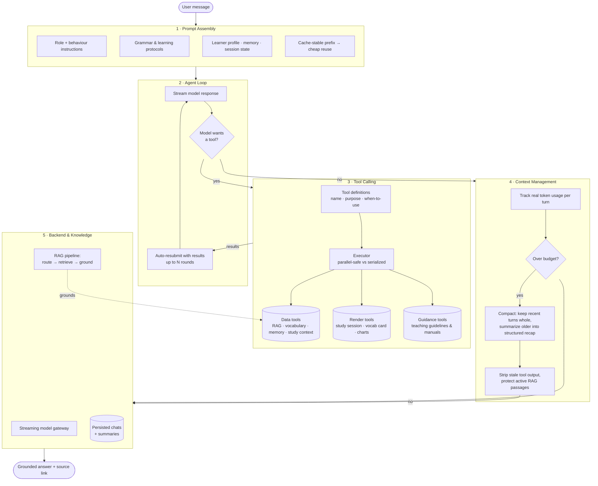
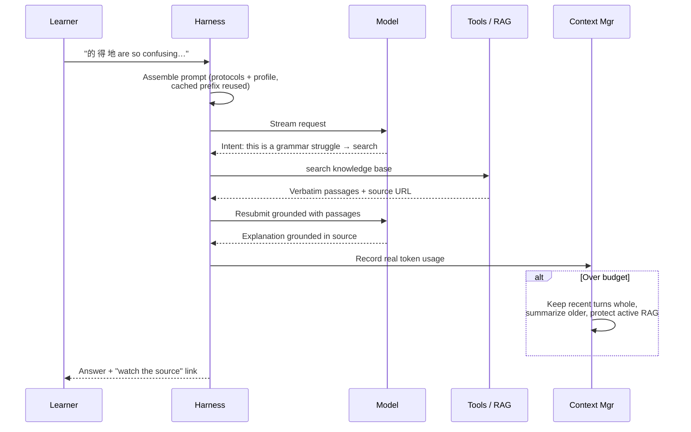

# ShadowLearn

A Chinese language learning platform built around the **shadowing technique**. Upload a YouTube video or audio file, and ShadowLearn turns it into an interactive lesson — with transcription, pinyin, translation, vocabulary extraction, and a full study suite.

   

---

## Features

- **Lesson creation** — paste a YouTube URL or upload a video/audio file; the backend handles download, transcription, pinyin annotation, translation, and vocabulary extraction automatically
- **Shadowing mode** — listen → speak → reveal flow with per-segment audio playback and recording
- **Study sessions** — 7 exercise types: cloze, reconstruction, translation, character writing, and more; driven by spaced repetition
- **AI companion** — in-lesson chat powered by OpenRouter for grammar questions and explanations
- **Vocabulary workbook** — review and track words across all lessons
- **Progress tracking** — skill mastery grid, accuracy trends, mistake history, review queue
- **Offline-first** — all user data lives in IndexedDB; no account required
- **Secure** — API keys are stored encrypted (PIN-protected AES-256) in the browser; never sent to the backend

---

## Tech Stack

| Layer | Stack |
|---|---|
| Frontend | React 19, TypeScript, Vite, Tailwind CSS v4, shadcn/ui |
| State | Context API + custom hooks, IndexedDB (idb) |
| Backend | FastAPI, Python 3.12, uv |
| Transcription | Deepgram (default) or Azure Speech |
| TTS | Azure Neural TTS (default) or Minimax |
| Translation / LLM | OpenRouter (Qwen, etc.) |
| Deployment | Docker Compose or split (Vercel + HF Spaces) |

---

## AI Companion — Harness Architecture

The AI companion is not a single LLM call — it's an engineered agent harness. A turn flows through five layers and loops back.

### The Layers (one turn flows top → bottom → back)



### One Turn, End to End



### Engineering Wins

- **Infers intent** — fires retrieval on *implicit* struggle, not just explicit questions.
- **Grounded, not guessed** — grammar answers come from retrieved source passages, always cited.
- **Agentic loop** — multi-round tool use, not single-shot.
- **Never dead-ends** — compaction keeps long sessions alive instead of "start a new chat."
- **Cost-aware** — stable prompt prefix → cache hits → lower latency &amp; spend.

---

## Getting Started

### Prerequisites

- Node.js 20+ and [pnpm](https://pnpm.io/installation)
- Python 3.12+ and [uv](https://docs.astral.sh/uv/)
- `ffmpeg` installed on the system (required for audio processing)
- API keys — see [API Keys](#api-keys) below

### 1. Clone the repo

```bash
git clone https://github.com/xzneozx96/shadow-learn.git
cd shadow-learn
```

### 2. Backend

```bash
cd backend
cp .env.example .env
# Fill in SHADOWLEARN_TTS_PROVIDER and any optional overrides in .env
uv sync
uv run uvicorn app.main:app --reload
```

The backend runs at `http://localhost:8000`.

### 3. Frontend

```bash
cd frontend
pnpm install
pnpm dev
```

The frontend runs at `http://localhost:5173`.

On first launch, the app will prompt you to set a PIN and enter your API keys. These are encrypted and stored locally — they are never sent to the ShadowLearn backend.

---

## API Keys

ShadowLearn uses third-party APIs for speech and AI features. You enter them once in the app's setup screen:

| Key | Where to get it | Required? |
|---|---|---|
| **OpenRouter** | [openrouter.ai/keys](https://openrouter.ai/keys) | Yes — translation, LLM chat, quiz generation |
| **Deepgram** | [console.deepgram.com](https://console.deepgram.com) | Yes (default STT) |
| **Azure Speech key + region** | [Azure portal](https://portal.azure.com) → Azure AI Services | Yes (default TTS + optional STT) |
| **Minimax** | [minimax.io](https://minimax.io) | Only if using Minimax TTS |

---

## Docker Compose (full stack)

```bash
cp backend/.env.example backend/.env
# Edit backend/.env as needed
docker compose up --build
```

The app will be available at `http://localhost`.

---

## Deployment

**Frontend → Vercel**

1. Import the repo in Vercel
2. Set root directory to `frontend`, build command `pnpm build`, output directory `dist`
3. Add env var `VITE_API_BASE=<your-backend-url>` in Vercel project settings

**Backend → Hugging Face Spaces (Docker)**

HF Spaces Docker SDK gives 16 GB RAM / 2 vCPU free. Create a new Space with SDK: Docker, push the `backend/` directory, and add secret env vars (`AZURE_SPEECH_KEY`, `DEEPGRAM_API_KEY`, etc.) in the Space settings.

---

## Project Structure

```
shadow-learn/
├── backend/               # FastAPI application
│   ├── app/
│   │   ├── routers/       # HTTP handlers (lessons, chat, tts, quiz, …)
│   │   ├── services/      # Business logic (audio, transcription, translation, …)
│   │   ├── models.py      # Shared Pydantic models
│   │   └── config.py      # pydantic-settings (SHADOWLEARN_ env prefix)
│   └── tests/
├── frontend/              # React + Vite application
│   ├── src/
│   │   ├── components/    # UI — lesson, study, shadowing, progress, ui primitives
│   │   ├── contexts/      # AuthContext, PlayerContext, LessonsContext, VocabularyContext
│   │   ├── hooks/         # Feature hooks (TTS, pronunciation, quiz, tracking, …)
│   │   ├── lib/           # Pure utilities (pinyin, shadowing logic, spaced repetition, …)
│   │   ├── pages/         # Top-level route pages
│   │   └── db/            # IndexedDB schema and typed accessors
│   └── tests/
└── docker-compose.yml
```

---

## Development

```bash
# Backend tests (install dev deps first)
cd backend && uv sync --extra dev && uv run pytest

# Frontend tests
cd frontend && pnpm test

# Frontend lint
cd frontend && pnpm lint
```

---

## License

MIT
